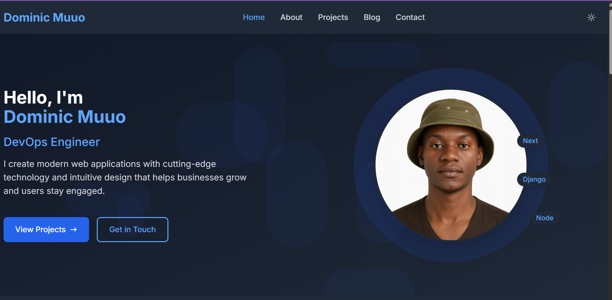

# Personal Portfolio Website



## Overview

A modern, responsive portfolio website built with React.js and Node.js, showcasing my skills, projects, and achievements. The website features an interactive UI, a contact form with email notifications, and SEO optimization for better visibility.

## Table of Contents

- [Features](#features)
- [Tech Stack](#tech-stack)
- [API Endpoints](#api-endpoints)
- [Deployment](#deployment)
- [License](#license)

## Features

- **Interactive Resume & Portfolio Section**
  - Dynamic project displays with filtering options
  - Animated skill bars and progress indicators
  - Downloadable resume in PDF format

- **Responsive Design**
  - Mobile-first approach
  - Cross-browser compatibility
  - Smooth animations and transitions

- **Contact Form with Email Notifications**
  - Form validation
  - Emailjs integration for email notifications
  - Spam protection

- **Blog Integration**
  - Content management system
  - Comment functionality
  - Social sharing options

- **SEO Optimization**
  - Meta tags for better search engine visibility
  - Sitemap generation
  - Structured data markup

- **Admin Dashboard**
  - Project management interface
  - Analytics integration
  - Content update capabilities

## Tech Stack

### Frontend
- React.js
- React Router for navigation
- Redux for state management
- Styled Components / SASS
- Framer Motion for animations

### Backend
- Node.js
- Express.js for API routing
- JWT for authentication
- Nodemailer for email notifications

### Database
- MongoDB
- Mongoose ODM / Sequelize ORM

### DevOps & Tools
- Webpack for bundling
- Babel for transpilation
- ESLint and Prettier for code quality
- Git for version control
- Jest for testing

## API Endpoints

### Projects
- `GET /api/projects` - Get all projects
- `GET /api/projects/:id` - Get specific project
- `POST /api/projects` - Create new project (admin only)
- `PUT /api/projects/:id` - Update project (admin only)
- `DELETE /api/projects/:id` - Delete project (admin only)

### Blog
- `GET /api/posts` - Get all blog posts
- `GET /api/posts/:id` - Get specific blog post
- `POST /api/posts` - Create new blog post (admin only)
- `PUT /api/posts/:id` - Update blog post (admin only)
- `DELETE /api/posts/:id` - Delete blog post (admin only)

### Contact
- `POST /api/contact` - Submit contact form

## Deployment

### Frontend Deployment (Netlify/Vercel)
1. Connect your GitHub repository to Netlify/Vercel
2. Configure build settings:
   - Build command: `cd client && npm run build`
   - Publish directory: `client/build`
3. Set environment variables
4. Deploy

### Backend Deployment (Heroku)
1. Install Heroku CLI
2. Login to Heroku
   ```bash
   heroku login
   ```
3. Create a new Heroku app
   ```bash
   heroku create your-portfolio-api
   ```
4. Add a database
   ```bash
   heroku addons:create mongodb:hobby-dev
   ```
5. Configure environment variables
   ```bash
   heroku config:set NODE_ENV=production
   heroku config:set JWT_SECRET=your_jwt_secret
   # Add other environment variables
   ```
6. Deploy
   ```bash
   git subtree push --prefix server heroku main
   ```

## License

This project is licensed under the MIT License - see the [LICENSE](LICENSE) file for details.

---

## Acknowledgements
- Icons from [FontAwesome](https://fontawesome.com)
- Design inspiration from [Awwwards](https://www.awwwards.com)
- All technologies and libraries used in this project

## Contact

Dominic Muuo - [muuomusyoki018@gmail.com](mailto:muuomusyoki018@gmail.com.com)

Project Link: ()